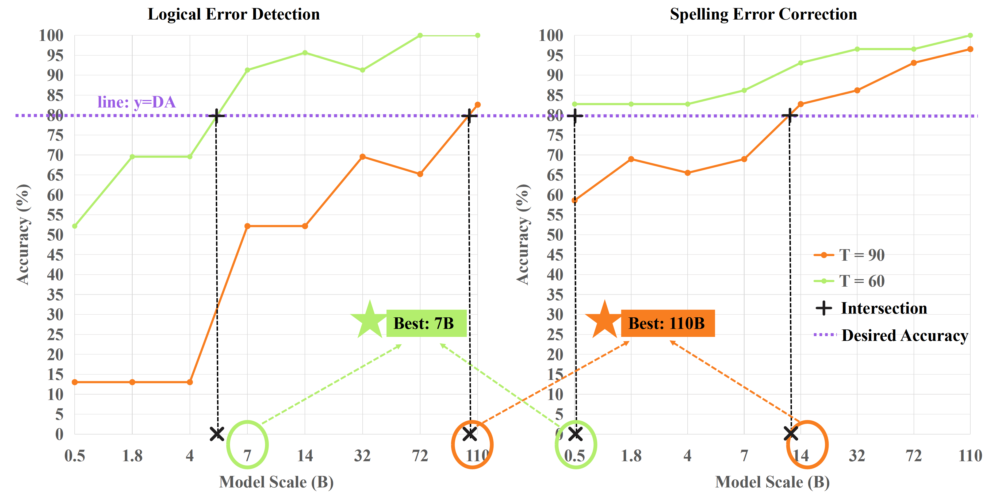

# ``A-Eval``: Application-driven Evaluation for Large Language Models
 

## Introduction
A-Eval is a benchmark designed to evaluate Chat LLMs of various scales from a practical application perspective. 
The dataset includes ``678`` question-and-answer pairs spanning ``5`` categories, ``27`` sub-categories, and ``3`` difficulty levels. 
A-Eval offers clear empirical and engineering guidelines for choosing the "best" model for real-world applications.

## Application-driven tasks taxonomy


* ``678`` QA pairs
* ``5`` categories, ``27`` sub-categories
* ``3`` difficulty levels

## Evaluation Results
Based on QWen1.5-72B-Chat, we design an automatic evaluation method to evaluate models of 8 varying scales.


<p align="center">
Accuracy of models of various scales on each task and its sub-tasks. (a) Accuracy when T = 60. (b) Accuracy when T = 90.
</p> 

## Model Selection
The best model is defined as the one that achieves the desired accuracy with the smallest size. 
Using the evaluation results, users can effortlessly identify the best model by drawing horizontal lines on the performance charts. This is an example:


## Citation
If you use this benchmark or dataset in your research, please cite our paper.
```bash
@misc{lian2024best,
      title={What is the best model? Application-driven Evaluation for Large Language Models}, 
      author={Shiguo Lian and Kaikai Zhao and Xinhui Liu and Xuejiao Lei and Bikun Yang and Wenjing Zhang and Kai Wang and Zhaoxiang Liu},
      year={2024},
      eprint={2406.10307},
      archivePrefix={arXiv},
}
```
