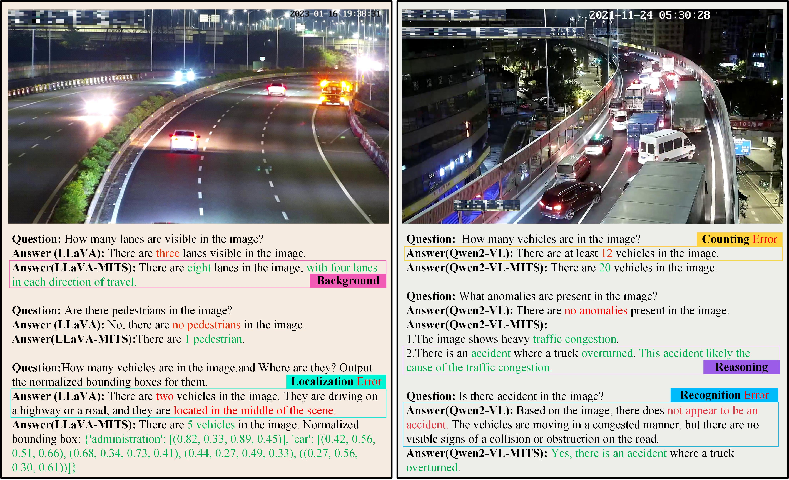
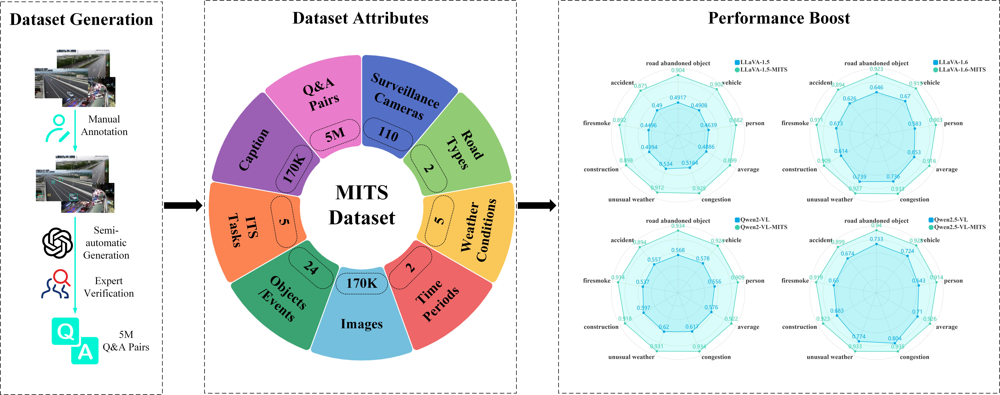

# MITS: Multimodal Intelligent Traffic Surveillance

A large-scale **multimodal dataset** for intelligent traffic surveillance.
**170,400 images** paired with **~5M instruction-following VQA samples**, covering recognition, counting, localization, background awareness, and reasoning in diverse ITS scenes (e.g., congestion, spills, unusual weather, construction, fireworks/smoke, accidents).

<div align="center">



<em>MITS Example</em>

</div>


<div align="center">



<em>MITS Introduction</em>

</div>

---

## Table of Contents

* [Code](#Code)
* [Models](#models)
* [Dataset](#dataset)
* [Quickstart](#quickstart)

  * [Training](#training)
  * [Inference](#inference)
* [Data Structure](#data-structure)
* [Citation](#citation)
* [License](#license)
* [Contributing](#contributing)
* [Contact](#contact)

---

## Code

```bash
git clone git@github.com:LifeIsSoSolong/Multimodal-Intelligent-Traffic-Surveillance-Dataset-Models.git
cd Multimodal-Intelligent-Traffic-Surveillance-Dataset-Models
pip install -r requirements.txt
```

> Requirements are listed in `requirements.txt`. Use a recent Python and CUDA/PyTorch stack if you plan to train or run VL models.

---

## Models

Pretrained / finetuned checkpoints hosted on ModelScope:

* **llava-v1.5-7b-traffic**
  [https://www.modelscope.cn/models/zhaokaikai/llava-1.5-7b-hf-traffic](https://www.modelscope.cn/models/zhaokaikai/llava-1.5-7b-hf-traffic)
* **llava-v1.6-7b-traffic**
  [https://www.modelscope.cn/models/zhaokaikai/Qwen2.5-VL-3B-Instruct-Traffic](https://www.modelscope.cn/models/zhaokaikai/Qwen2.5-VL-3B-Instruct-Traffic)
* **Qwen2-VL-7B-Traffic**
  [https://www.modelscope.cn/models/zhaokaikai/Qwen2-VL-7B-Instruct-Traffic](https://www.modelscope.cn/models/zhaokaikai/Qwen2-VL-7B-Instruct-Traffic)
* **Qwen2.5-VL-3B-Traffic**
  [https://www.modelscope.cn/models/zhaokaikai/Qwen2.5-VL-3B-Instruct-Traffic](https://www.modelscope.cn/models/zhaokaikai/Qwen2.5-VL-3B-Instruct-Traffic)
* **Qwen2.5-VL-7B-Traffic**
  [https://www.modelscope.cn/models/zhaokaikai/Qwen2.5-VL-7B-Instruct-Traffic](https://www.modelscope.cn/models/zhaokaikai/Qwen2.5-VL-7B-Instruct-Traffic)

> Tip: For each model, see its ModelScope page for exact usage, tokenizer/processor, and license.

---

## Dataset

* **Name:** `Multimodal_Intelligent_Traffic_Surveillance`
* **Host:** ModelScope
* **Link:** [https://www.modelscope.cn/datasets/zhaokaikai/Multimodal_Intelligent_Traffic_Surveillance](https://www.modelscope.cn/datasets/zhaokaikai/Multimodal_Intelligent_Traffic_Surveillance)
* **Size:** 75 G

---

## Quickstart

### Training

If you use the provided script:

```bash
# Example
bash ./train.sh
```

Adjust hyperparameters, paths, and model names inside `train.sh` to match your environment and GPU setup.

### Inference

```bash
python inference.py \
  --model <model_name_or_path> \
  --image_path /path/to/sample.jpg \
  --question "What is the traffic state at the intersection?"
```

See `inference.py` for supported flags (batch size, precision, device, etc.).

---

## Data Structure

A typical layout when using our dataset and training assets:

```
project/
├── train.sh
├── inference.py
├── requirements.txt
├── data/
│   └── MITS/                      # downloaded dataset root (example)
│       ├── images/
│       │   ├── v1.0_train_1/
│       │   ├── v1.0_train_2/
│       │   └── ...
│       └── vqas/
│           ├── integratedinput_v1.0_train_1/
│           ├── integratedinput_v1.0_train_2/
│           └── ...
└── models/
    └── <optional local checkpoints>
```

---

## Citation

If you find MITS useful, please cite our paper:

```bibtex
@article{zhao2025mits,
  title   = {MITS: A large-scale multimodal benchmark dataset for Intelligent Traffic Surveillance},
  author  = {Zhao, Kaikai and Liu, Zhaoxiang and Wang, Peng and Wang, Xin and Ma, Zhicheng and Xu, Yajun and Zhang, Wenjing and Nan, Yibing and Wang, Kai and Lian, Shiguo},
  journal = {Image and Vision Computing},
  pages   = {105736},
  year    = {2025},
  publisher = {Elsevier}
}
```

---

## License

* Code is released under the license specified in `LICENSE` (add or update this file as needed).
* Please check each model and the dataset pages on ModelScope for their respective licenses and terms.

## Contact
China Unicom AI Innovation Center, China United Network Communication Group Co.,Ltd.
